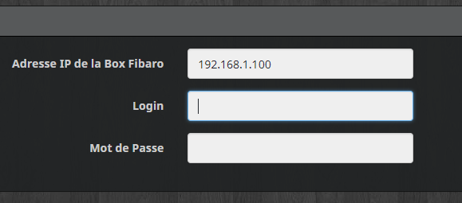
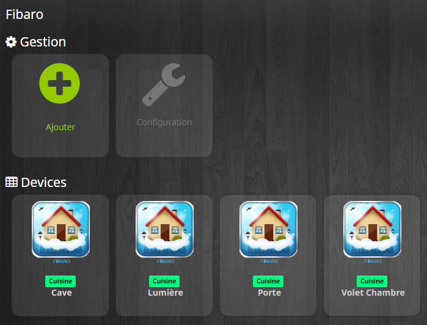
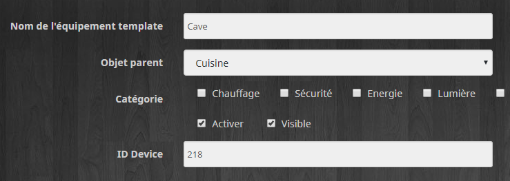

Description 
===

Plugin Fibaro récupère et interagie avec les modules de vos box HC2 ou HCL. 
Le type de module est détecté automatiquement puis inséré dans Jeedom.
Modules compatible:
- interrupteur On/Off (état / on / off)
- Capteurs de températures (état)
- Volet roulant  (état / Open / close / stop / slider)

Configuration
===

Renseignez l'IP / login et mot de passe de votre box (HC2 ou HCL)

Cliquez sur bouton **Ajouter**

Renseignez bien **ID** de votre module que vous souhaitez d'ajouter

Retour d'information Fibaro->Jeedom
===

Pour Rafraîchir des modules et leurs passer l'information de changement d'état il faut creer une scene dans votre HC2

**_Code LUA_**

    --[[
    %% properties
    221 value ---- Id des modules Fibaro
    197 value ---- --//--
    218 value
    665 value
    246 value
    705 value
    %% events
    %% globals
    --]]

    local deviceID = {2004,2005,2062,2058,2094,2114}; -- ID de la commande Rafraichir de chaque module Jeedom
    apiKeyJeedom = fibaro:getGlobal("ApiJeedom"); -- API de votre Jeedom enregistré dans une variable globale
    for i=1, #deviceID do

    local http = net.HTTPClient()
    local url = "http://IP_Jeedom/core/api/jeeApi.php?apikey=" ..apiKeyJeedom .."&type=cmd&id=" ..deviceID[i]  
    http:request(url, {
	    success = function(response)
		    if response.status == 200 then
			    fibaro:debug('OK, réponse : '.. response.data)
		    else
			    fibaro:debug("Erreur : status=" .. tostring(response.status))
		    end
	    end,
	    error = function(err)
		    fibaro:debug("Erreur : " .. err)
	    end,
	    options = {
		    method = 'GET'
	    }
    })  
    i=i+1;
    end'
